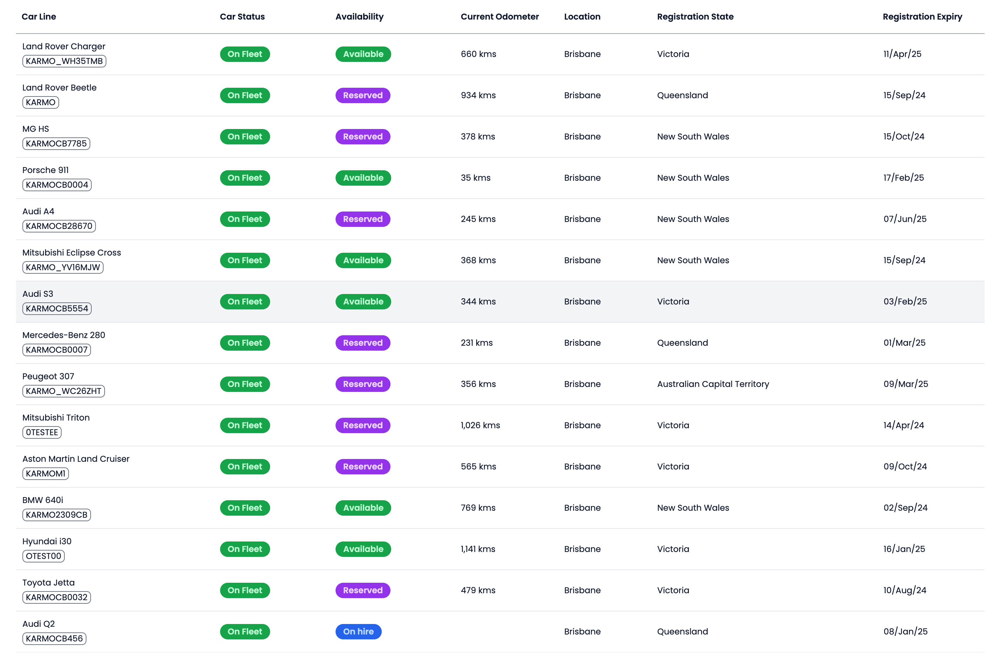

# Karmo Full-Stack Coding Test

This is coding test for full-stack software engineers

## Description
In this coding test, you need to build up an inventory page that shows a list of vehicles with a range of attributes with the following mapping

| Field Name | Vehicle Attributes |
| ----- | ---- |
| Car Line - upper text | make + model |
| Car Line - lower text | registrationNumber |
| Car Status | status |
| Availability | availability |
| Current Odometer | currentOdometerReading |
| Registration State | registrationState |
| Registration Expiry | registrationExpiry |

### Example 



## Frontend Requirement
Search `TODO` to finish tasks
- A table showing a a list of vehicles
- Column names showing on the first row of table
- Two lines for Car Line column
- Car Status and Availability should be colour labeled
- Showing empty cell for missing values
- Registration Expiry follows AU format
- Unit tests


## Backend Requirement
Search `TODO` to finish tasks
- An API returning a list of vehicles with above fields
- Unit tests


## Dependency
- [Next.js](https://nextjs.org) - full-stack framework
- [Prisma](https://prisma.io) - DB orm
- [Tailwind CSS](https://tailwindcss.com) class based styling (optional)
- [tRPC](https://trpc.io) - API protocal
- [SQLite](https://www.sqlite.org/) - memory-based DB
- [Vite](https://vitest.dev/) - testing suite

## Installation
```
npm i
```

## How to run in local
```
npm run dev
```

then go http://localhost:3000


## How to run test
```
npm test
```

## How to view DB data
```
npm run db:studio
```
Browswer opens webview of local DB at http://localhost:5555


## Code Structure

| Folder | Purpose |
| ----- | ---- |
| /src | application source |
| /src/app | frontend code |
| /src/server | server API code |
| /src/styles | global styling |
| /src/trpc | TRPC route setting |
# cars-react
